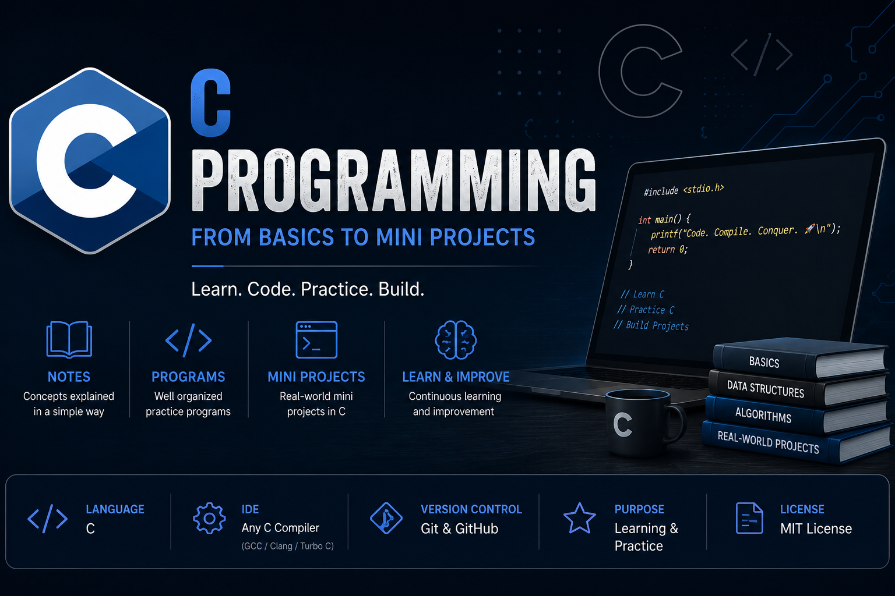

<div align="center">

# 💻 C Programming

### From Fundamentals to Real-World Mini Projects

<p>


</p>



</div>

---

# 📖 About

Welcome to my **C Programming** repository.

This repository documents my journey of learning **C Programming**, covering everything from fundamental concepts to practical mini projects. It serves as a personal learning archive while also acting as a useful reference for students beginning their programming journey.

---

# ✨ What's Inside

- 📘 Well-Organized Notes
- 💻 C Programming Examples
- ⚙️ Practice Programs
- 🛠️ Mini Projects
- 📚 Problem Solving
- 🚀 Continuous Learning

---

# 📂 Repository Structure

```text
C-Programming

├── Notes
├── Projects
├── assets
│   └── preview.png
│
├── README.md
├── LICENSE
└── .gitignore
```

---

# 🛠️ Tech Stack

<div align="center">


</div>

---
